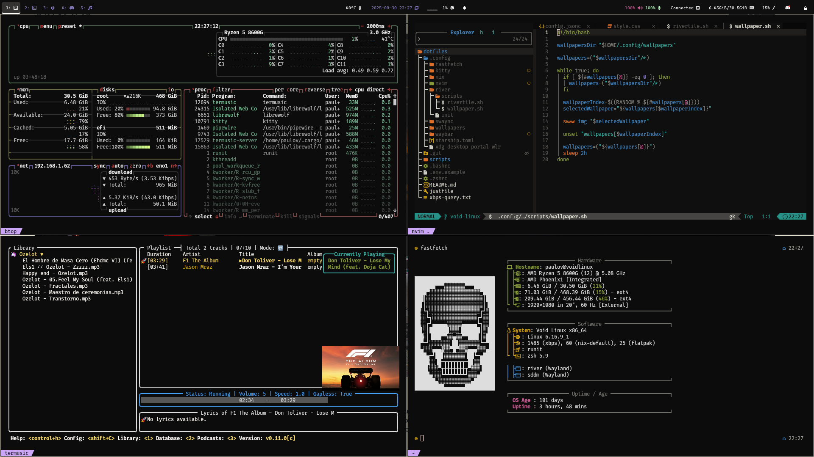

> [!NOTE]
> If you want to know more about my work, visit my **[ORCID](https://orcid.org/0009-0000-1211-9373)** (0009-0000-1211-9373)

  
<b>Workflow Time (My Time Working)</b>

   
  

  
<b>Desktop Screenshot (Void Linux)</b>

   
  
Here are my dotfiles: <a href="https://github.com/hyduez/dotfiles">git@github.com:hyduez/dotfiles</a>. Just another ahh bunch of common libraries

  

  
<b>Spotify Now-Playing (deprecated, i'm not using it anymore)</b>

   
  

`@paulov:mozilla.org` at matrix, `hyduez.t.me` on telegram or just `hyduez` on discord. Or check `0x6C0F4EF2A7BF244B5FDC2DAD45289929995D9F4B` (PGP)
