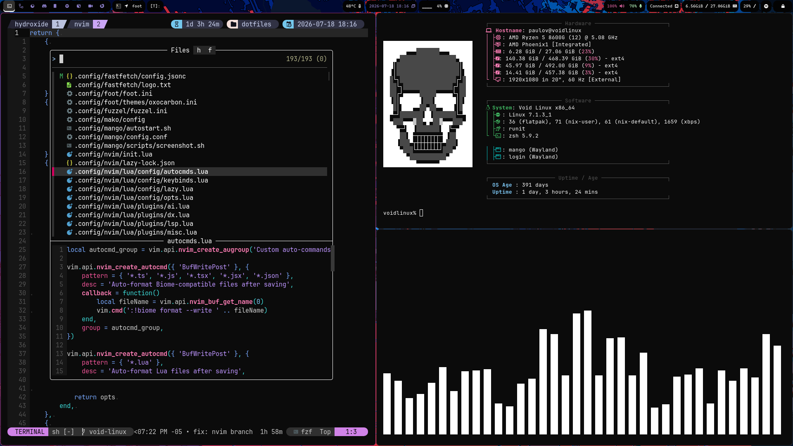

> [!NOTE]
> If you want to know more about my work, visit my **[ORCID](https://orcid.org/0009-0000-1211-9373)** (0009-0000-1211-9373) :basecamp:

### Latest Activity on GitHub :octocat:

<!--START_SECTION:activity-->
- 🍱 Pushed [89ad05a](https://github.com/hyduez/rocky/commit/89ad05a3ce90e5a4a1ba67c8fcc52c23ffaae0a4) in [hyduez/rocky](https://github.com/hyduez/rocky)
- 🍱 Pushed [986249a](https://github.com/hyduez/rocky/commit/986249ac7768bb8a17b2a46208a217412077d11c) in [hyduez/rocky](https://github.com/hyduez/rocky)
- 🍱 Pushed [8614809](https://github.com/hyduez/bitnet/commit/8614809c9553bd11b67151babd83d2c9b5be8bf9) in [hyduez/bitnet](https://github.com/hyduez/bitnet)
- 🌌 Forked [microsoft/BitNet](https://github.com/microsoft/BitNet) in [hyduez/bitnet](https://github.com/hyduez/bitnet)
- 🍱 Pushed [96e0c68](https://github.com/dousec/nixos/commit/96e0c6856e2ca35c1f48064191eb813e28afdf89) in [dousec/nixos](https://github.com/dousec/nixos)
<!--END_SECTION:activity-->

  
<b>Workflow Time (My Time Working)</b>

   
  

  
<b>Desktop Screenshot (Void Linux)</b>

   
  
Here are my dotfiles: <a href="https://github.com/hyduez/dotfiles">git@github.com:hyduez/dotfiles</a>. Just another bunch of common libraries (old screenshot with river-classic)

  

  
<b>GitHub's Commit Streak</b>

   
  

Check `0x6C0F4EF2A7BF244B5FDC2DAD45289929995D9F4B` (PGP) for my SMTP/XMPP user.

###### I only land my skill sets and cv on jobs platform, here you can look at **[@dousec](https://github.com/dousec)** and **[@nosesisaid](https://github.com/nosesisaid)**. GMT-5 🇪🇨
