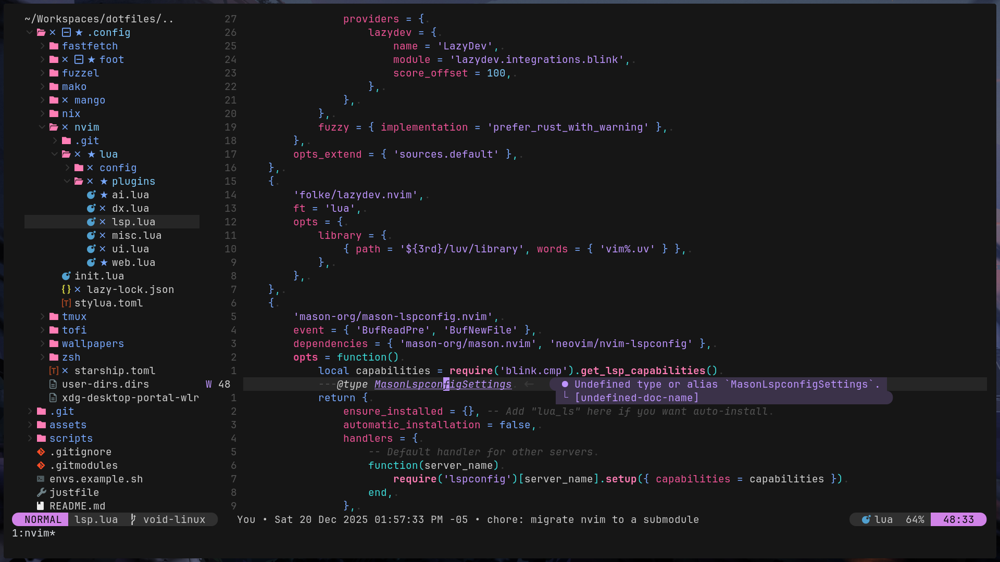

> [!NOTE]
> If you want to know more about my work, visit my **[ORCID](https://orcid.org/0009-0000-1211-9373)** (0009-0000-1211-9373)

  
<b>Workflow Time (My Time Working)</b>

   
  

  
<b>Desktop Screenshot (Void Linux)</b>

   
  
Here are my dotfiles: <a href="https://github.com/hyduez/dotfiles">git@github.com:hyduez/dotfiles</a>. Just another ahh bunch of common libraries

  

  
<b>GitHub's Commit Streak</b>

   
  

`@paulov:mozilla.org` at matrix, `hyduez.t.me` on telegram or just `hyduez` on discord. Or check `0x6C0F4EF2A7BF244B5FDC2DAD45289929995D9F4B` (PGP)

<!--START_SECTION:activity-->
- ⭐ Added a star to [vulhunt-re/vulhunt](https://github.com/vulhunt-re/vulhunt)
- ⭐ Added a star to [ravachol/kew](https://github.com/ravachol/kew)
- ⭐ Added a star to [laytan/cloak.nvim](https://github.com/laytan/cloak.nvim)
- 🍱 Pushed [undefined commits](https://github.com/hyduez/dotfiles/tree/refs/heads/void-linux) in [hyduez/dotfiles](https://github.com/hyduez/dotfiles)
- 🍱 Pushed [undefined commits](https://github.com/hyduez/dotfiles/tree/refs/heads/void-linux) in [hyduez/dotfiles](https://github.com/hyduez/dotfiles)
- 🍱 Pushed [undefined commits](https://github.com/hyduez/homelab-podman/tree/refs/heads/master) in [hyduez/homelab-podman](https://github.com/hyduez/homelab-podman)
- ⭐ Added a star to [casdoor/casdoor](https://github.com/casdoor/casdoor)
- 🍱 Pushed [undefined commits](https://github.com/hyduez/homelab-podman/tree/refs/heads/master) in [hyduez/homelab-podman](https://github.com/hyduez/homelab-podman)
- 🍱 Pushed [undefined commits](https://github.com/hyduez/dotfiles/tree/refs/heads/void-linux) in [hyduez/dotfiles](https://github.com/hyduez/dotfiles)
- 🍱 Pushed [undefined commits](https://github.com/hyduez/dotfiles/tree/refs/heads/void-linux) in [hyduez/dotfiles](https://github.com/hyduez/dotfiles)
- 🍱 Pushed [undefined commits](https://github.com/hyduez/dotfiles/tree/refs/heads/void-linux) in [hyduez/dotfiles](https://github.com/hyduez/dotfiles)
- ⭐ Added a star to [DelSkayn/rquickjs](https://github.com/DelSkayn/rquickjs)
- ⭐ Added a star to [dino/dino](https://github.com/dino/dino)
- ⭐ Added a star to [lapce/floem](https://github.com/lapce/floem)
- ⭐ Added a star to [johnthagen/min-sized-rust](https://github.com/johnthagen/min-sized-rust)
<!--END_SECTION:activity-->
