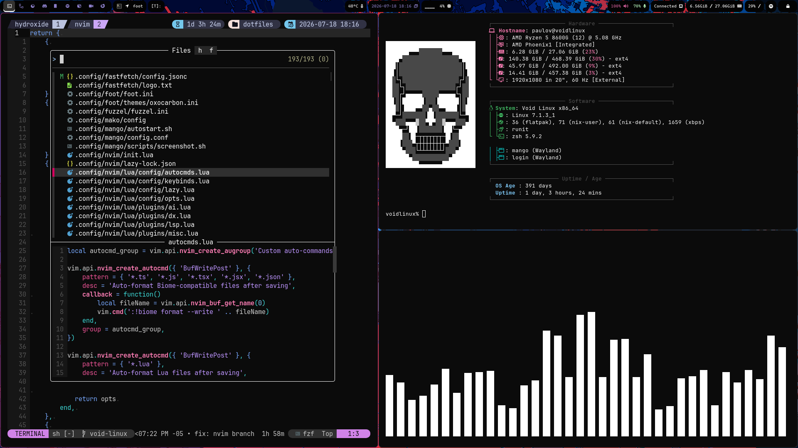

> [!NOTE]
> If you want to know more about my work, visit my **[ORCID](https://orcid.org/0009-0000-1211-9373)** (0009-0000-1211-9373) :basecamp:

### Latest Activity on GitHub :octocat:

<!--START_SECTION:activity-->
- 🍱 Pushed [35f8bca](https://github.com/hyduez/dotfiles/commit/35f8bca54590ff62ffdd534d27dcf2cedb148423) in [hyduez/dotfiles](https://github.com/hyduez/dotfiles)
- 🍱 Pushed [e7537cc](https://github.com/hyduez/dotfiles/commit/e7537ccfd0775ae9748b3636f6232effd9c464bb) in [hyduez/dotfiles](https://github.com/hyduez/dotfiles)
- 🍱 Pushed [297cafe](https://github.com/hyduez/dotfiles/commit/297cafe0489a3e663a15a37b831b092c1ad89ab4) in [hyduez/dotfiles](https://github.com/hyduez/dotfiles)
- 🍱 Pushed [12e60c1](https://github.com/hyduez/dotfiles/commit/12e60c1681d1d9e89d83336f37f9605052bb2fc3) in [hyduez/dotfiles](https://github.com/hyduez/dotfiles)
- ⭐ Added a star to [go-chi/chi](https://github.com/go-chi/chi)
<!--END_SECTION:activity-->

  
<b>Workflow Time (My Time Working)</b>

   
  

  
<b>Desktop Screenshot (Void Linux)</b>

   
  
Here are my dotfiles: <a href="https://github.com/hyduez/dotfiles">git@github.com:hyduez/dotfiles</a>. Just another bunch of common libraries (old screenshot with river-classic)

  

  
<b>GitHub's Commit Streak</b>

   
  

Check `0x6C0F4EF2A7BF244B5FDC2DAD45289929995D9F4B` (PGP) for my SMTP/XMPP user.

###### I only land my skill sets and cv on jobs platform, here you can look at **[@dousec](https://github.com/dousec)** and **[@nosesisaid](https://github.com/nosesisaid)**. GMT-5 🇪🇨

### Featured channel I reaaly like :)

<!-- BEGIN YOUTUBE-CARDS -->

<!-- END YOUTUBE-CARDS -->
