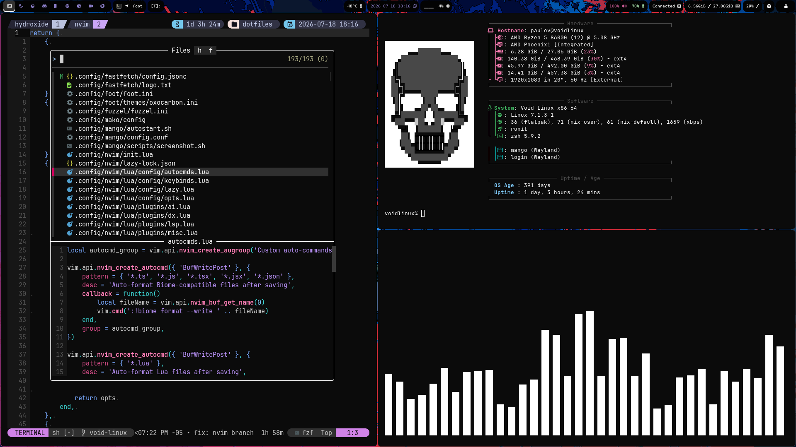

> [!NOTE]
> If you want to know more about my work, visit my **[ORCID](https://orcid.org/0009-0000-1211-9373)** (0009-0000-1211-9373) :basecamp:

### Latest Activity on GitHub :octocat:

<!--START_SECTION:activity-->
- 🍱 Pushed [297cafe](https://github.com/hyduez/dotfiles/commit/297cafe0489a3e663a15a37b831b092c1ad89ab4) in [hyduez/dotfiles](https://github.com/hyduez/dotfiles)
- 🍱 Pushed [7f2d1b3](https://github.com/hyduez/daven-looking-for-his-puddin/commit/7f2d1b3b8696368435946cb3b5bfa7e4944a6991) in [hyduez/daven-looking-for-his-puddin](https://github.com/hyduez/daven-looking-for-his-puddin)
- 🌱 Created [master](https://github.com/hyduez/daven-looking-for-his-puddin/tree/master) branch in [hyduez/daven-looking-for-his-puddin](https://github.com/hyduez/daven-looking-for-his-puddin)
- 🍱 Pushed [5913ff9](https://github.com/hyduez/sch/commit/5913ff9ff8a33059b164f688c1228c709261ea45) in [hyduez/sch](https://github.com/hyduez/sch)
- 🍱 Pushed [0ff5117](https://github.com/hyduez/sch/commit/0ff51174b133ef7be1edd87792e3c8db34092fa5) in [hyduez/sch](https://github.com/hyduez/sch)
<!--END_SECTION:activity-->

  
<b>Workflow Time (My Time Working)</b>

   
  

  
<b>Desktop Screenshot (Void Linux)</b>

   
  
Here are my dotfiles: <a href="https://github.com/hyduez/dotfiles">git@github.com:hyduez/dotfiles</a>. Just another bunch of common libraries (old screenshot with river-classic)

  

  
<b>GitHub's Commit Streak</b>

   
  

Check `0x6C0F4EF2A7BF244B5FDC2DAD45289929995D9F4B` (PGP) for my SMTP/XMPP user.

###### I only land my skill sets and cv on jobs platform, here you can look at **[@dousec](https://github.com/dousec)** and **[@nosesisaid](https://github.com/nosesisaid)**. GMT-5 🇪🇨

### Featured channel I reaaly like :)

<!-- BEGIN YOUTUBE-CARDS -->

<!-- END YOUTUBE-CARDS -->
